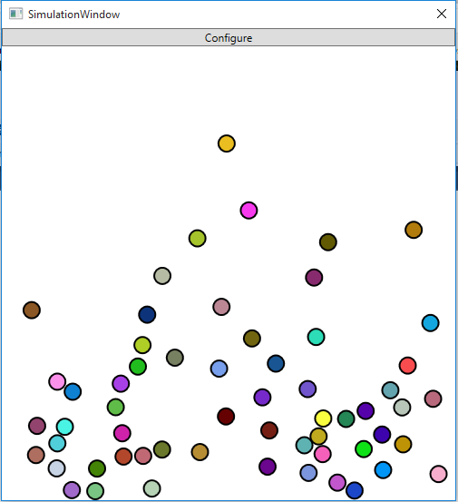

# Funcionamiento mínimo

Lo primero que puedes hacer para hacer una prueba mínima de la aplicación es
hacer click en el botón de `Start Simulation`, lo que lanzará una simulación con
los valores por defecto.

A partir de ahora tienes... **¡Exacto! Una preciosa ventana en blanco**. No
obstante: puedes **hacer click** sin problemas para ver el funcionamiento...
Y dejar caer la primera bola.

Eso es muy poco divertido... Puedes hacer click como loco para ver a las leyes
de la física actuar para divertirte.

Una vez estés en esa pantalla, puedes abrir el cuadro de diálogo de
configuración para cambiar la gravedad, o modificar los valores de la siguiente
bola que hagas aparecer.

También te permite, haciendo doble click en la fila, recuperar una partida
guardada anteriormente.

# Configuración avanzada

Cuando cierras la simulación, volverás a la pantalla principal. Desde ahí puedes
cerrar definitivamente la aplicación, o configurar otra partida más.

Habrás notado que también te ha aparecido la lista de partidas guardadas ahí,
por si te apetece cargar una anterior.

En esa pantalla puedes configurar una gran cantidad de cosas.

## Dimensiones del canvas

Por defecto están las mínimas ($500\times500$). Siéntete libre de configurar
cualquier valor de ancho y alto por encima.

## Gravedad

Supongo que necesita poca descripción.

## Objetos

Cada objeto es una pelota. Puedes tener un número infinito de pelotas, cada una
con unos valores diferentes.

### Velocidad

La velocidad inicial de la pelota.

### Posición inicial

La posición inicial de la pelota. Nótese que **la coordenada $(0, 0)$ es la superior
izquierda**.

### Factor de rebote

Este es un multiplicador que se usa para simular rozamiento. Cuando un objeto
rebota con otro o con una pared, la velocidad resultante será multiplicada por
ese factor. Por defecto está a uno, aunque puedes disminuirlo a tu gusto,
o aumentarlo (con cuidado, las bolas acabarán a una velocidad enorme).

### Radio

Poco hay que explicar acerca de este valor.

### Masa

La masa de una pelota no afecta a su velocidad de caída, pero si a sus choques.
Sigue las leyes de la física, así que guíate por tu conocimiento para
configurarla: Ya sabes lo que va a pasar si pones una pelota de masa 1 a chocar
con una de masa 500.

# Objetivo

Diviértete :P
